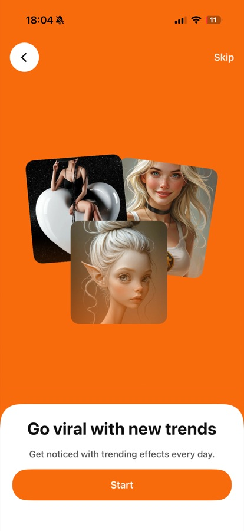
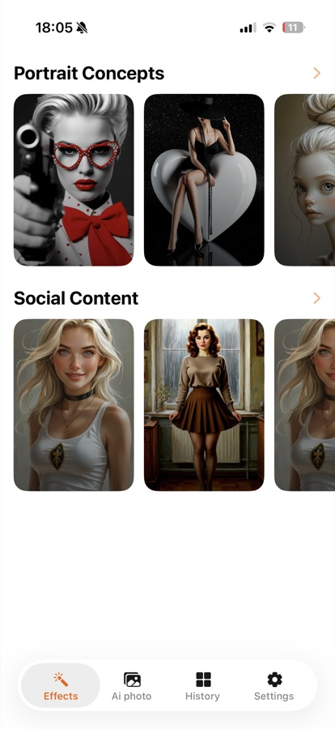
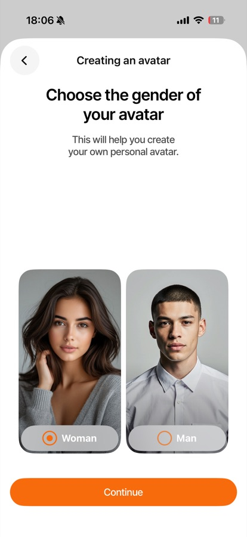
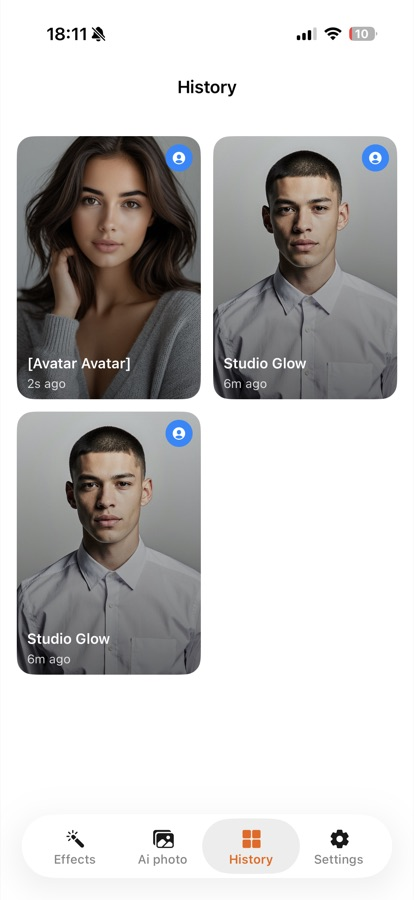
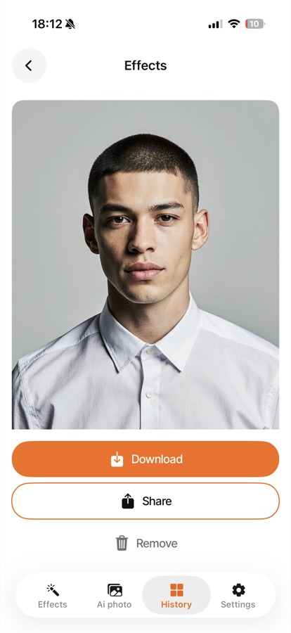
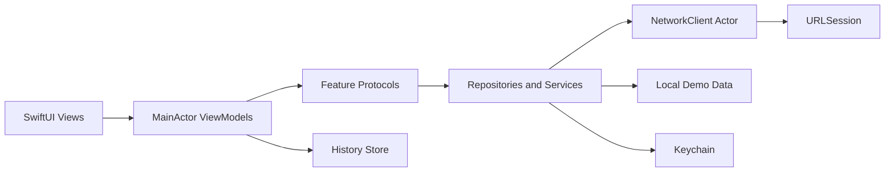

<div align="center">
  
  <h1>AI Photo Portfolio Demo</h1>
  <p><strong>A polished SwiftUI application for AI-powered photo effects, custom avatars, and image generation.</strong></p>
  <p>
    
    
    
    
  </p>
</div>

## Product Preview

<p align="center">
  
  &nbsp;
  
  &nbsp;
  
  &nbsp;
  
  &nbsp;
  
</p>

<p align="center">
  <sub>Onboarding | Effects discovery | Avatar creation | Local history | Export and sharing</sub>
</p>

## Overview

This project demonstrates a complete mobile product flow rather than a collection of isolated screens. Users can browse visual effects, create and manage avatars, generate images from prompts, revisit previous results, and export their work. The public build includes realistic local demo data, so the main experience can be reviewed without credentials or access to a private backend.

### Product Highlights

- Guided onboarding and a custom tab-based navigation experience.
- Curated effect categories with reusable avatar-based generation flows.
- Multi-step avatar creation with validation and photo selection.
- Prompt-based image generation with configurable aspect ratios.
- Persistent generation history with detail, download, share, and delete actions.
- Subscription, notification, legal-document, and rating flows.
- Offline portfolio mode for reliable demos and screenshots.

## Engineering Highlights

- **SwiftUI + MVVM:** feature-focused screens use `@MainActor` view models and explicit UI state.
- **Structured concurrency:** async operations use `async/await`; the shared networking layer is isolated in an `actor`.
- **Dependency injection:** `AppEnvironment` is the composition root, while features depend on protocols such as `EffectsRepository`, `ImageGenService`, and `AvatarServicing`.
- **Networking:** one reusable `NetworkClient` handles authorization, query construction, JSON encoding and decoding, multipart uploads, downloads, status validation, and typed errors.
- **Secure persistence:** authentication tokens are stored in Keychain instead of `UserDefaults`; generated files and their metadata are managed separately.
- **Testability:** URL loading is injected through `URLSession`, allowing deterministic request and error tests without contacting a live server.
- **Public-safe configuration:** committed build settings contain placeholders only, while sensitive local configuration is ignored by Git.



## Project Structure

```text
BroadAppsTestApp/
|-- App/                         # Application entry point and lifecycle
|-- Modules/                     # UI features: Effects, Avatar, History, Settings...
|-- Sources/Core/                # Configuration, networking, shared models
`-- Sources/Features/            # Feature data and domain layers
Shared/
|-- Components/                  # Reusable SwiftUI components
|-- Extensions/                  # Focused platform helpers
`-- Assets.xcassets/             # Colors, icons, fonts, and demo imagery
BroadAppsTestAppTests/            # Unit tests and network stubs
```

## Getting Started

### Requirements

- Xcode 16 or newer
- iOS 17.6 or newer
- macOS capable of running the iOS Simulator

### Run the Portfolio Build

1. Clone the repository.
2. Open `BroadAppsTestApp.xcodeproj` in Xcode.
3. Select the `BroadAppsTestApp` scheme and an iOS simulator.
4. Build and run with `Cmd + R`.

Both committed configurations use `PORTFOLIO_MODE = YES`. This routes the effects catalog to local demo data and keeps the public project usable without private API credentials.

## Tests

The XCTest target covers URL resolution, demo repository invariants, authenticated request construction, response decoding, and typed server errors. Network tests use a custom `URLProtocol` stub and never make external requests.

Run the suite from Xcode with `Cmd + U`, or from the command line:

```sh
xcodebuild test \
  -project BroadAppsTestApp.xcodeproj \
  -scheme BroadAppsTestApp \
  -destination 'platform=iOS Simulator,name=iPhone 16'
```

Build the release configuration without code signing:

```sh
xcodebuild build \
  -project BroadAppsTestApp.xcodeproj \
  -scheme BroadAppsTestApp \
  -configuration Release \
  -destination 'generic/platform=iOS Simulator' \
  CODE_SIGNING_ALLOWED=NO
```

## Configuration & Security

The repository contains demo-safe values only. `BASE_URL`, `APPHUD_API_KEY`, and related values are supplied through build settings and exposed to the app via `Info.plist`; no production credentials are embedded in Swift source code.

Use `BroadAppsTestApp/Sources/Core/Config/Secrets.example.xcconfig` as a reference for local integration. Keep real API keys, signing assets, `.env` files, `GoogleService-Info.plist`, `.p8` files, and provisioning profiles outside version control.

---

<div align="center">
  <strong>Built as an iOS engineering portfolio project with emphasis on product completeness, clean boundaries, safe configuration, and testable asynchronous code.</strong>
</div>
